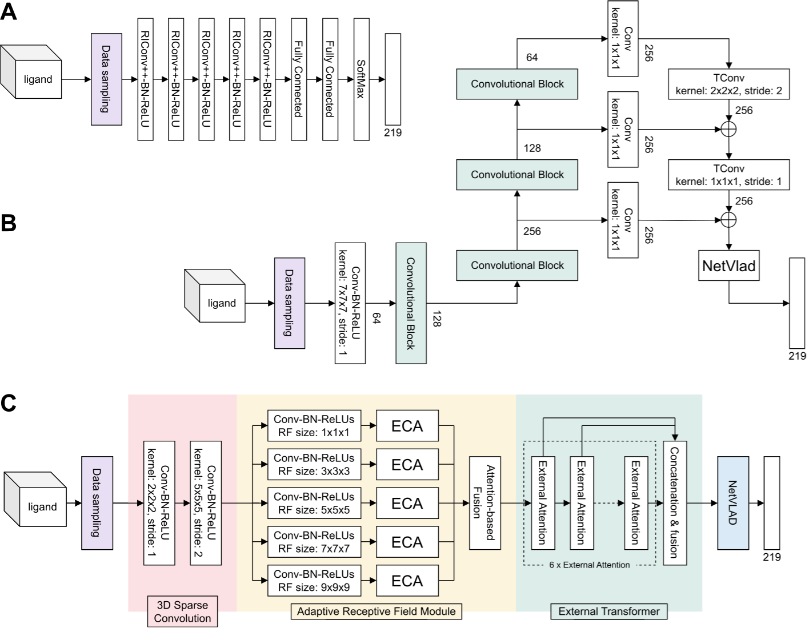
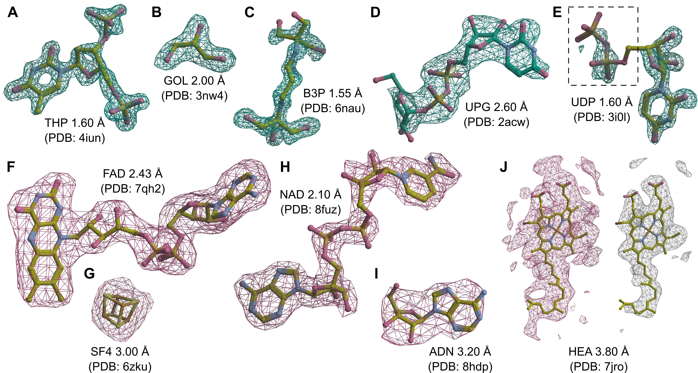

[](https://ligands.cs.put.poznan.pl)
[](https://www.biorxiv.org/content/10.1101/2024.08.27.610022v1)
[](https://zenodo.org/records/10908325)


# Ligand Identification in CryoEM and X-ray Maps Using Deep Learning

[Jacek Karolczak](https://github.com/jkarolczak), [Anna Przybyłowska](https://github.com/annprzy), [Konrad Szewczyk](https://github.com/konradszewczyk), [Witold Taisner](https://github.com/wtaisner), [John M. Heumann](https://github.com/jmheumann),
Michael H.B.
Stowell, [Michał Nowicki](https://github.com/MichalNowicki?tab=repositories), [Dariusz Brzezinski](https://github.com/dabrze)

Accurately identifying ligands plays a crucial role in structure-guided drug design.
Based on density maps from X-ray diffraction or cryogenic-sample electron microscopy (cryoEM), scientists verify whether
small-molecule ligands bind to active sites.
However, the interpretation of density maps is challenging, and cognitive bias can sometimes mislead investigators into
modeling fictitious compounds.
Ligand identification can be aided by automatic methods, but existing approaches are available only for X-ray
diffraction.
Here, we propose to identify ligands using a deep learning approach that treats density maps as 3D point clouds.
We show that the proposed model is on par with existing methods for X-ray crystallography while also being applicable to
cryoEM density maps.
Our study demonstrates that electron density map fragments can be used to train models that can be applied to cryoEM
structures, but also highlights challenges associated with the standardization of electron microscopy maps and the
quality assessment of cryoEM ligands.

In the repository, we provide the code for the experiments conducted in the paper, including model implementations and
transformations for generating datasets.
To reproduce the results, use scripts from the `scripts` directory.
Configuration files for the experiments are available in the `cfg` directory.

We provide weights of the model trained on cryoEM and X-ray crystallography
as `model.pt` ([link](https://github.com/jkarolczak/ligand-classification/blob/main/model.pt)).

---

Presented below are schematics of deep learning architectures used to predict ligands:

<ol type="A">
  <li>The RiConv++ architecture with five enhanced rotation invariant convolution (RIConv++) layers.</li>
  <li>The MinkLoc3Dv2 architecture utilizing information from a pyramid of three feature maps with different receptive fields.</li>
  <li>The TransLoc3D architecture built from four modules: 3D Sparse Convolution, Adaptive Receptive Field, External Transformer, and NetVLAD.</li>
</ol>

All the architectures were modified to take as input the same sample of 2000 voxels (or less in case of ligands is
described by default by smaller number of voxels) and output the probability scores of all the studied 219 ligand
groups.



---

Here are some snapshots of ligand identifications made by the proposed MinkLoc3Dv2 model.

- (A–D) Examples of correctly predicted X-ray ligands.
- (E) Uridine-5’-diphosphate (UDP) misclassified as uridine (URI, black dashed frame).
- (F–I) Examples of correctly predicted cryoEM ligands.
- (J) Heme A (HEM) misclassified as a rare ligand due to incorrect density thresholding.



Each ligand is labeled by its Chemical Component Dictionary ID, structure resolution, and (in parentheses) the PDB ID,
chain, and residue number. X-ray diffraction ligands shown in green mesh based on Fo-Fc maps contoured at 2.8σ
calculated after removal of solvent and other small molecules (including the ligand) from the model.
CryoEM ligands depicted in pink mesh based on difference maps contoured according to the proposed automatic density
thresholding method (13.642, 3.385, 17.997, 7.850, and 5.613 V for panels F–J, respectively). The white mesh in panel J
shows a manually selected contour threshold of 11.000 V. Atomic coordinates were taken from the PDB deposits.

---

## Demo

The model trained on blobs from cryoEM and X-ray crystallography can be tested without the need to install
anything.
The model is deployed as a Streamlit app under the link [ligands.cs.put.poznan.pl](https://ligands.cs.put.poznan.pl).

---

## API

The Ligand Classification API provides endpoints for classifying ligands from 3D point cloud data using a model trained
on all the data mentioned in the paper, including blobs from cryoEM and X-ray crystallography.
The API supports various file formats for point cloud input and returns the top 10 predicted ligand classes along with
their probabilities.

Each user is limited to one request per second.

**Base URL:** `http://ligands.cs.put.poznan.pl`

### Endpoints

#### 1. Health Check - `[GET]` `http://ligands.cs.put.poznan.pl/api`

Checks if the Ligand Classification API is operational.

###### Responses

- **200**: Success

  <details>

  Example response:
  ```text
  Ligand Classification API is up and running!
  ```

  </details>

- **500**: Server Error

  <details>

  <summary>Error Details</summary>

  ```json
  {
    "error": "Internal Server Error"
  }
  ```
  </details>

---

#### 2. Classify Ligand - `[POST]` `http://ligands.cs.put.poznan.pl/api/predict`

Classifies the uploaded 3D point cloud data and returns the top 10 most likely ligand classes along with their
respective probabilities.

###### Request Body

- **file** (`string`, `binary`, required):  
  Supported formats: `.npy`, `.npz`, `.pts`, `.xyz`, `.txt`, `.csv`

  <details>

    - `.npy`, `.npz`:
        - dense three dimensional numpy array
    - `.xyz`, `.txt`:
        - without any header
        - each line describe a voxel following the pattern `x y z density`
    - `.pts`
        - the first line contains information about number of points (lines)
        - each line describe a voxel following the pattern `x y z density`
    - `.csv`
        - files with headers and headerless are supported
        - each line describe a voxel following the pattern `x, y, z, density`
          Example: `example.npy`

  </details>

- **rescale_cryoem** (`string`, optional):  
  Indicates whether to rescale the cryoEM data. Accepts `"true"` or `"false"`.  
  Example: `"false"`

- **resolution** (`number`, optional):  
  The resolution value for cryoEM data rescaling. Required if `rescale_cryoem` is `"true"`.  
  Example: `1.5`

###### Responses

- **200**: Successfully classified ligand

  <details>

  Example response:
  ```json
  {
    "predictions": [
      {
        "Class": "ATP",
        "Probability": 0.82
      },
      {
        "Class": "GTP",
        "Probability": 0.07
      },
      ...
    ]
  }
  ```

</details>

- **400**: Bad Request (Multiple Possible Errors)

  <details>

    - **No file part in the request**

    <details>

    <summary>Error Details</summary>

    ```json
    {
      "error": "No file part in the request"
    }
    ```

    </details>

    - **Unsupported file format**

      <details>

      <summary>Error Details</summary>

      ```json
      {
        "error": "Unsupported file format"
      }
      ```

      </details>

    - **Missing resolution when rescale_cryoem is true**

      <details>

      <summary>Error Details</summary>

      ```json
      {
        "error": "No resolution part in the request"
      }
      ```

      </details>

- **500**: Internal Server Error

  <details>

  <summary>Error Details</summary>

  ```json
  {
    "error": "An unexpected error occurred"
  }
  ```
  </details>

</details>

## Environment setup

### Docker

To simplify the setup and ensure consistency, we provide a Docker configuration that includes all necessary
dependencies.

#### Prerequisites

Ensure you have the following installed:

- [Docker](https://docs.docker.com/engine/install/) (>= 20.0.0)
- [Docker Compose](https://docker-docs.netlify.app/compose/install/#install-compose) (>= 2.0.0)
- (Optional) For GPU support:
    - [CUDA](https://developer.nvidia.com/cuda-downloads) (>= 11.3)
    - [NVCC](https://docs.nvidia.com/cuda/cuda-compiler-driver-nvcc/index.html)
    - [cuDNN](https://developer.nvidia.com/cudnn) (>= 8.0)
    - [NVIDIA Docker Runtime](https://developer.nvidia.com/nvidia-container-runtime)

#### Steps to Start

1. Clone this repository.
2. Set the necessary permissions: `sudo chmod 744 ./start.sh ./stop.sh`
3. Configure the environment by editing the `docker/.env` file:
    - Adjust `PYTORCH`, `CUDA`, and `CUDNN` settings if needed (for GPU use).
    - Set the `DATA_PATH` to point to your data directory. Default is `../../data/`.
4. Start the container:
    - For GPU use: `./start.sh`
    - For CPU use: `./start.sh cpu`
5. To stop the container:
    - For GPU use: `./stop.sh`
    - For CPU use: `./stop.sh cpu`

## Data

All the data necessary to reproduce results is available at [Zenodo](https://zenodo.org/record/10908325).

Repository with code for extracting ligands from CryoEM difference maps is a submodule of this repository, but can be
also found [here](https://github.com/dabrze/cryo-em-ligand-cutter/tree/6032b5701cad7a4db86f780b91c2078907e36e42).

Additionally, the preprocessed data (uniformly sampled and max pooled 2000 points per ligand) that were used to train
the final model are available [here](https://ligands.blob.core.windows.net/ligands/blobs_uniform_2000_max.tar.gz).

## Citation

```
@article {Karolczak2024.08.27.610022,
	author = {Karolczak, Jacek and Przyby{\l}owska, Anna and Szewczyk, Konrad and Taisner, Witold and Heumann, John M. and Stowell, Michael H.B. and Nowicki, Micha{\l} and Brzezinski, Dariusz},
	title = {Ligand Identification using Deep Learning},
	elocation-id = {2024.08.27.610022},
	year = {2024},
	doi = {10.1101/2024.08.27.610022},
	publisher = {Cold Spring Harbor Laboratory},
	abstract = {Motivation Accurately identifying ligands plays a crucial role in the process of structure-guided drug design. Based on density maps from X-ray diffraction or cryogenic-sample electron microscopy (cryoEM), scientists verify whether small-molecule ligands bind to active sites of interest. However, the interpretation of density maps is challenging, and cognitive bias can sometimes mislead investigators into modeling fictitious compounds. Ligand identification can be aided by automatic methods, but existing approaches are available only for X-ray diffraction and are based on iterative fitting or feature-engineered machine learning rather than end-to-end deep learning.Results Here, we propose to identify ligands using a deep learning approach that treats density maps as 3D point clouds. We show that the proposed model is on par with existing machine learning methods for X-ray crystallography while also being applicable to cryoEM density maps. Our study demonstrates that electron density map fragments can be used to train models that can be applied to cryoEM structures, but also highlights challenges associated with the standardization of electron microscopy maps and the quality assessment of cryoEM ligands.Availability Code and model weights are available on GitHub at https://github.com/jkarolczak/ligands-classification. Datasets used for training and testing are hosted at Zenodo: 10.5281/zenodo.10908325.Contact dariusz.brzezinski{at}cs.put.poznan.plCompeting Interest StatementThe authors have declared no competing interest.},
	URL = {https://www.biorxiv.org/content/early/2024/08/28/2024.08.27.610022},
	eprint = {https://www.biorxiv.org/content/early/2024/08/28/2024.08.27.610022.full.pdf},
	journal = {bioRxiv}
}
```
