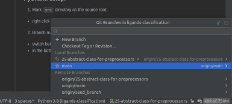
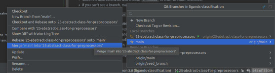

# Ligand classification using deep neural networks

## Environment

### Docker

We provide a docker setup with all dependencies and runtime configuration. To start the container follow:

1. Have installed:
    - [docker](https://docs.docker.com/engine/install/)  (>=20.0.0)
    - [docker compose](https://docker-docs.netlify.app/compose/install/#install-compose) (>=2.0.0!, notice, that the
      page suggests installing older version)
    - additionally, to run using GPU:
        - [cuda](https://developer.nvidia.com/cuda-downloads) (>=11.3)
          , [nvcc](https://docs.nvidia.com/cuda/cuda-compiler-driver-nvcc/index.html)
          and [cudnn](https://developer.nvidia.com/cudnn) (>= 8.0)
        - [nvidia docker runtime](https://developer.nvidia.com/nvidia-container-runtime)
2. Clone this repository.
3. `sudo chmod 744 ./start.sh ./stop.sh`
4. Set the environment configuration in the `docker/.env`:
    - `PYTORCH`, `CUDA`, `CUDNN` - only for GPU, modify only if needed. Before changing verify against Minkowski Engine
      requirements
    - `DATA_PATH` - if your name is Adaś and you are computer you should leave it as it is. If your name is Ania, Witek
      or Konrad, RNG guesses it is `../../data/`. In other cases set the path to the folder containing data
5. Start container using `./start.sh`. If you want to run container on cpu use `./start.sh cpu`.
6. To stop use `./stop.sh` or `./stop.sh cpu` for cpu respectively.

### PyCharm setup: ###

1. Mark `src` directory as the source root:
    - right click on `src` directory -> Mark Directory As -> Source root
    - with this step done, PyCharm will consider `src` as source directory, therefore to reach `ligands-classification`
      directory remember to use `../` in your code.
2. Exclude unnecessary directories from indexing:
    - PyCharm automatically indexes files in the project, so that it can propose i.e. path completion, yet some
      directories should not be indexed:
    - similarly to the first step: right click on directory -> Mark Directory As -> Excluded
    - directories to exclude: `.neptune`, `data` and `venv` if present
3. Branch management:
    - switch between the branches using PyCharm GUI, not with terminal tools
    - in the bottom-right corner, there is a special menu:

- select the desired branch and choose `Checkout` in order to switch branches,
- if you can't see a branch, make sure to run `git fetch` from the Git toolbar menu.

4. Pulling changes from `main` branch into a task branch:
    - should there be some update on the `main` branch, please make sure to include them and **resolve potential merge
      conflicts** before creating a pull request from your task branch
    - checkout to the `main` branch
    - update project using Git toolbar menu
    - checkout to the task branch
    - open branch menu -> choose main branch -> Merge 'main' into task branch
    - thanks to the above, all commits merged into the `main` branch will be applied to the specific branch

## Data

### Labels (.csv)

- All [[download](https://ligands.blob.core.windows.net/ligands/cmb_blob_labels.csv)]
- Train set [[download](https://ligands.blob.core.windows.net/ligands/train.csv)]
- Holdout [[download](https://ligands.blob.core.windows.net/ligands/holdout.csv)]

### Datasets

- Raw [[download](https://ligands.blob.core.windows.net/ligands/cmb_blob_labels.csv)]
- Surface (neighbourhood=22) + uniform selection (max_blob_size=2000,
  method=basic) [[download](https://ligands.blob.core.windows.net/ligands/blobs_shell_22_uniform_2000_basic.tar.gz)]
- Surface (neighbourhood=22) + uniform selection (max_blob_size=2000,
  method=max) [[download](https://ligands.blob.core.windows.net/ligands/blobs_shell_22_uniform_2000_max.tar.gz)]
