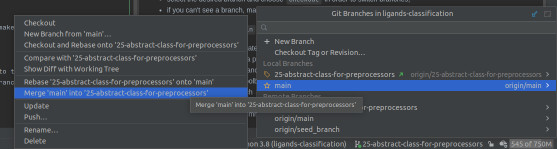

[](http://ForTheBadge.com)

# Ligand classification using deep neural networks

## Environment

### Docker

**Building Docker image from Dockerfile**
No additional configuration is required, simply execute in ligands-classification folder:

```
docker build . -t <name-of-image>
```

**Running existing Docker image**
The recommended way of running our Docker image would be:

```
sudo docker run --rm -it --init --gpus=all --ipc=host --volume="<path-to-folder>:/app" -w="/app" <name-of-image> /bin/bash
```

with <path-to-folder> pointing to the folder containing data folder and cloned ligands-classification repository

### PyCharm setup: ###

1. Mark `src` directory as the source root:
    - right click on `src` directory -> Mark Directory As -> Source root
    - with this step done, PyCharm will consider `src` as source directory, therefore to reach `ligands-classification`
      directory remember to use `../` in your code.
2. Exclude unnecessary directories from indexing:
    - PyCharm automatically indexes files in the project, so that it can propose i.e. path completion, yet some
      directories should not be indexed:
    - similarly to the first step: right click on directory -> Mark Directory As -> Excluded
    - directories to exclude: `.neptune`, `data` and `venv` if present
3. Branch management:
    - switch between the branches using PyCharm GUI, not with terminal tools
    - in the bottom-right corner, there is a special menu:


- select the desired branch and choose `Checkout` in order to switch branches,
- if you can't see a branch, make sure to run `git fetch` from the Git toolbar menu.

4. Pulling changes from `main` branch into a task branch:
    - should there be some update on the `main` branch, please make sure to include them and **resolve potential merge
      conflicts** before creating a pull request from your task branch
    - checkout to the `main` branch
    - update project using Git toolbar menu
    - checkout to the task branch
    - open branch menu -> choose main branch -> Merge 'main' into task branch
    - thanks to the above, all commits merged into the `main` branch will be applied to the specific branch


